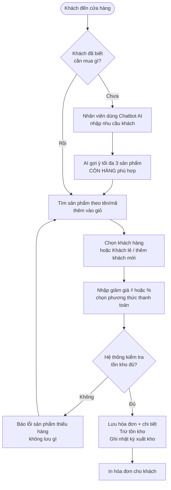
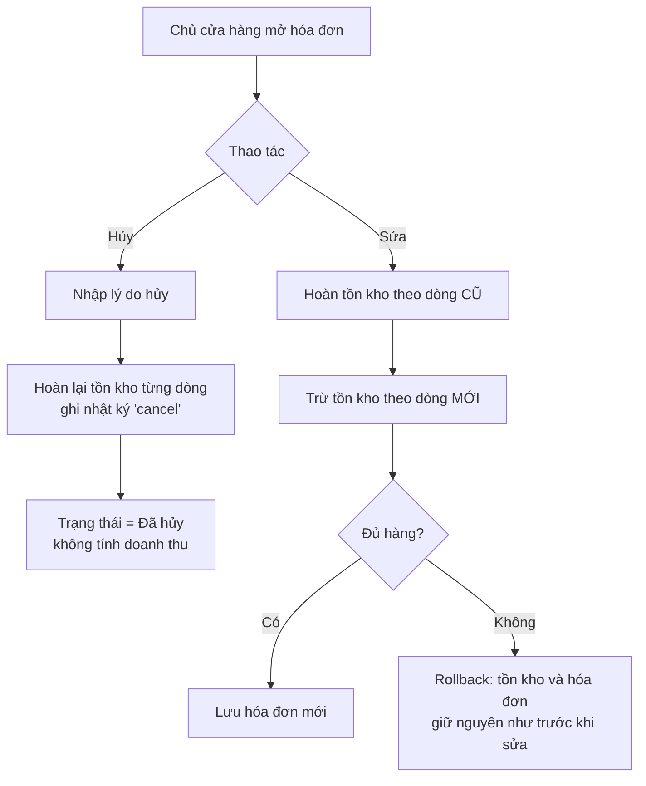
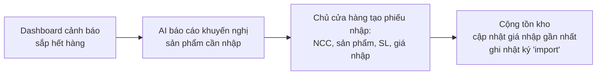
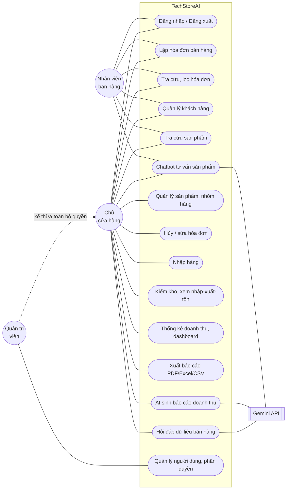
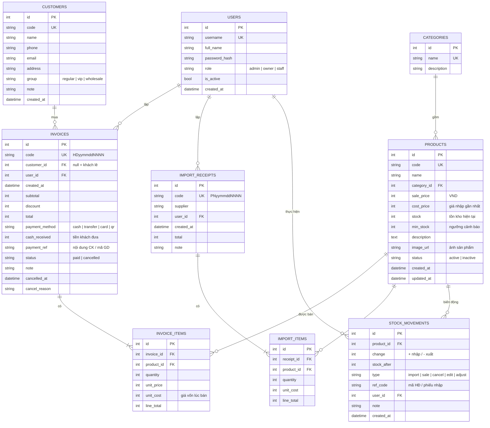
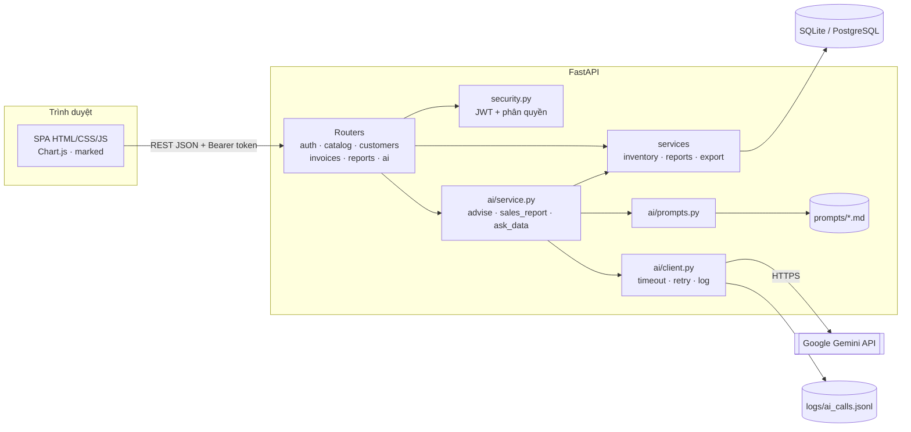
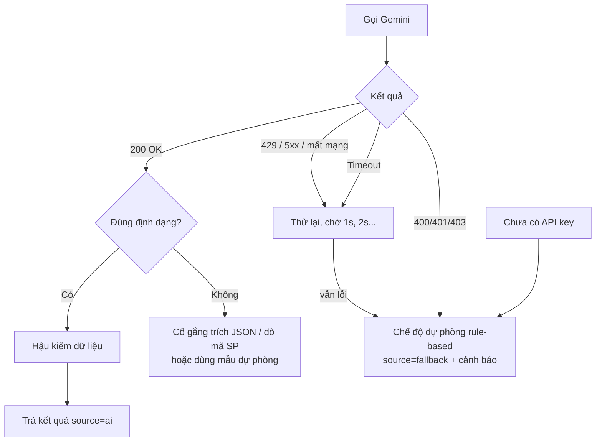

# Phân tích yêu cầu và thiết kế hệ thống (Bài KT1)

**Đề tài:** Hệ thống quản lý bán hàng có tích hợp AI (TechStoreAI)
**Công nghệ:** Python FastAPI · SQLAlchemy · SQLite (tương thích PostgreSQL/MySQL) · HTML/CSS/JavaScript · Google Gemini API

> Các sơ đồ viết bằng Mermaid. Xem trực tiếp trên GitHub/GitLab, VS Code (extension *Markdown Preview Mermaid Support*) hoặc dán vào https://mermaid.live để xuất ảnh đưa vào báo cáo.

---

## 1. Phạm vi hệ thống

Hệ thống phục vụ **một cửa hàng bán lẻ** (điện thoại, phụ kiện, thiết bị điện tử, gia dụng) với ba nhóm người dùng. Hệ thống quản lý vòng đời hàng hóa: **nhập hàng → tồn kho → bán hàng (hóa đơn) → báo cáo**. AI tạo sinh được tích hợp ở ba điểm: tư vấn sản phẩm cho khách, sinh báo cáo doanh thu và hỏi đáp dữ liệu bằng ngôn ngữ tự nhiên.

**Ngoài phạm vi:** quản lý nhiều chi nhánh, tích hợp cổng thanh toán online, kế toán công nợ nhà cung cấp, bán hàng online/giao hàng.

---

## 2. Phân tích quy trình nghiệp vụ

### 2.1. Quy trình bán hàng và lập hóa đơn



**Quy tắc nghiệp vụ:**
- BR1: Tổng tiền = Σ(số lượng × đơn giá) − giảm giá. Giảm giá ≤ tạm tính.
- BR2: Không bán vượt tồn kho; sản phẩm "ngừng kinh doanh" không bán được.
- BR3: Nhân viên không được tự sửa đơn giá; hệ thống dùng giá niêm yết.
- BR4: Lưu **giá vốn tại thời điểm bán** vào chi tiết hóa đơn để tính lãi gộp chính xác khi giá nhập thay đổi.
- BR5: Toàn bộ thao tác (lưu hóa đơn + trừ kho) nằm trong **một giao dịch**; lỗi ở bất kỳ dòng nào → rollback toàn bộ.
- BR8: Thanh toán tiền mặt: tiền khách đưa phải ≥ tổng tiền; hệ thống lưu lại và in tiền thừa trên hóa đơn.
- BR9: Thanh toán VietQR: mã QR chứa sẵn số tài khoản cửa hàng, số tiền và nội dung (TECHSTOREAI + thời điểm); thu ngân xác nhận đã nhận tiền thì hóa đơn mới được lưu. Nội dung được lưu vào `payment_ref` để đối soát với sao kê.

### 2.2. Quy trình hủy / sửa hóa đơn



- BR6: Hóa đơn đã hủy không thể hủy lại hay sửa (tránh hoàn kho hai lần).
- BR7: Chỉ Chủ cửa hàng / Quản trị viên được hủy, sửa hóa đơn.

### 2.3. Quy trình nhập hàng



### 2.4. Quản lý tồn kho (nhập - xuất - tồn)

Mọi thay đổi tồn kho đều đi qua **một hàm duy nhất** và ghi bảng `stock_movements` với loại: `import` (nhập), `sale` (bán), `cancel` (hủy HĐ), `edit` (sửa HĐ), `adjust` (kiểm kê). Nhờ đó có thể truy vết tồn kho của bất kỳ sản phẩm nào. Tồn kho không bao giờ âm. Form sửa sản phẩm **không cho sửa trực tiếp tồn kho**; muốn thay đổi phải qua phiếu nhập hoặc "Kiểm kho" có ghi lý do.

---

## 3. Tác nhân (Actor)

| Actor | Mô tả | Mục tiêu chính |
|---|---|---|
| **Nhân viên bán hàng** (staff) | Đứng quầy, phục vụ khách | Lập hóa đơn nhanh, tra cứu sản phẩm, tư vấn khách bằng chatbot |
| **Chủ cửa hàng** (owner) | Quản lý kinh doanh | Theo dõi doanh thu, tồn kho, nhập hàng, xem báo cáo AI, hỏi đáp số liệu |
| **Quản trị viên** (admin) | Quản trị hệ thống | Toàn quyền + quản lý tài khoản, phân quyền |
| **Gemini API** (hệ thống ngoài) | Dịch vụ AI tạo sinh | Sinh câu tư vấn, nhận xét báo cáo, câu trả lời |

---

## 4. Use case

### 4.1. Sơ đồ use case



### 4.2. Đặc tả use case chính

**UC2 – Lập hóa đơn bán hàng**

| Mục | Nội dung |
|---|---|
| Actor | Nhân viên bán hàng, Chủ cửa hàng |
| Tiền điều kiện | Đã đăng nhập; có sản phẩm còn hàng |
| Luồng chính | 1. Mở màn hình Bán hàng → 2. Tìm và chọn sản phẩm, chỉnh số lượng → 3. Chọn khách (tùy chọn) → 4. Nhập giảm giá, chọn thanh toán → 5. Bấm Thanh toán → 6. Hệ thống kiểm tra tồn kho, lưu hóa đơn, trừ kho → 7. Hiển thị hóa đơn để in |
| Luồng thay thế | 6a. Không đủ tồn kho → báo lỗi, không lưu. 3a. Khách mới → thêm nhanh khách hàng ngay trên màn hình bán |
| Hậu điều kiện | Hóa đơn trạng thái "Đã thanh toán"; tồn kho giảm; nhật ký kho có bản ghi `sale` |

**UC6 – Chatbot tư vấn sản phẩm**

| Mục | Nội dung |
|---|---|
| Actor | Nhân viên, Chủ cửa hàng; hệ thống ngoài Gemini API |
| Luồng chính | 1. Nhập nhu cầu khách ("tai nghe dưới 500k, pin lâu") → 2. Hệ thống lấy danh sách sản phẩm **đang bán và còn hàng** → 3. Ghép prompt từ `prompts/product_advisor_v3.md` → 4. Gọi Gemini, yêu cầu JSON → 5. Hậu kiểm: loại mã không tồn tại/hết hàng → 6. Hiển thị câu trả lời + thẻ sản phẩm (giá, tồn) + nút "Thêm vào giỏ" |
| Luồng thay thế | 4a. Timeout / rate limit / chưa có API key → tư vấn dự phòng theo từ khóa + ngân sách. 4b. Phản hồi không phải JSON → hiển thị văn bản, tự dò mã sản phẩm rồi hậu kiểm |

**UC13 – AI sinh báo cáo doanh thu**

| Mục | Nội dung |
|---|---|
| Actor | Chủ cửa hàng |
| Luồng chính | 1. Chọn kỳ báo cáo → 2. Hệ thống **tự tính** doanh thu, lãi gộp, so sánh kỳ trước, theo nhóm hàng, top bán chạy, bán chậm, sắp hết hàng → 3. Gửi JSON tổng hợp (không có thông tin cá nhân khách) cho AI → 4. AI viết báo cáo Markdown 5 mục cố định → 5. Hiển thị, cho sao chép/tải .md |
| Luồng thay thế | Không có hóa đơn → không gọi AI. AI lỗi / sai định dạng → báo cáo theo mẫu |

**UC14 – Hỏi đáp dữ liệu bán hàng**

| Mục | Nội dung |
|---|---|
| Actor | Chủ cửa hàng |
| Luồng chính | 1. Nhập câu hỏi ("Tháng này mặt hàng nào bán chậm?") → 2. Gửi Gemini lược đồ 7 view `v_ai_*` và câu hỏi, AI trả đúng một câu SELECT → 3. Bộ kiểm tra SQL (chỉ SELECT, chỉ view cho phép, không chú thích, không nhiều câu lệnh) → 4. Chạy trên kết nối chỉ đọc, LIMIT 200, timeout 5 giây; lỗi cú pháp cho AI sửa một lần → 5. Gửi bảng kết quả cho AI diễn giải → 6. Hiển thị câu trả lời, bảng kết quả và câu SQL |
| Thiết kế an toàn | Cập nhật theo SRS 6.5 (giả định A-20): text-to-SQL với 5 lớp bảo vệ (bảng 6.6). View đã bỏ cột nhạy cảm; SQL vi phạm không chạy và ghi `ai_logs` trạng thái `rejected_sql`. Với CSDL không phải SQLite, hệ thống quay về cách cũ: tự tính số liệu tổng hợp rồi gửi cho AI |

---

## 5. Yêu cầu chức năng

| Mã | Yêu cầu | Vai trò | Trạng thái |
|---|---|---|---|
| FR01 | Đăng nhập, đăng xuất bằng tài khoản; token JWT hết hạn sau 8 giờ | Tất cả | ✅ |
| FR02 | Phân quyền 3 vai trò: admin, owner, staff | Tất cả | ✅ |
| FR03 | CRUD sản phẩm: mã, tên, ảnh, nhóm hàng, giá bán, giá nhập, tồn kho, mức tồn tối thiểu, mô tả, trạng thái | Owner | ✅ |
| FR04 | CRUD nhóm hàng (danh mục) | Owner | ✅ |
| FR05 | CRUD khách hàng: liên hệ, nhóm khách (thường/VIP/sỉ), lịch sử mua, tổng chi tiêu | Staff, Owner | ✅ |
| FR06 | Lập hóa đơn: nhiều dòng, giảm giá theo ₫ hoặc %, in hóa đơn | Staff, Owner | ✅ |
| FR06a | 4 phương thức thanh toán: tiền mặt (tiền khách đưa, tiền thừa), chuyển khoản (nội dung CK), quẹt thẻ (mã giao dịch POS), quét mã VietQR | Staff, Owner | ✅ |
| FR06b | Thêm sản phẩm vào giỏ bằng quét QR / mã vạch (camera hoặc máy quét USB); in tem QR sản phẩm | Staff, Owner (in tem: Owner) | ✅ |
| FR07 | Hủy hóa đơn (có lý do) và sửa hóa đơn, tự động điều chỉnh tồn kho | Owner | ✅ |
| FR08 | Lập phiếu nhập hàng, cộng tồn kho, cập nhật giá nhập | Owner | ✅ |
| FR09 | Kiểm kho (điều chỉnh tồn có lý do), xem nhật ký nhập-xuất-tồn | Owner | ✅ |
| FR10 | Tìm kiếm, lọc sản phẩm (tên/mã, nhóm, còn/sắp hết/hết hàng, trạng thái), khách hàng (tên/SĐT, nhóm), hóa đơn (mã/khách, thời gian, trạng thái, thanh toán) | Tất cả | ✅ |
| FR11 | Thống kê doanh thu theo ngày, tháng, nhóm hàng; sản phẩm bán chạy, bán chậm; lãi gộp | Owner | ✅ |
| FR12 | Dashboard: doanh thu hôm nay/tháng, lãi gộp, biểu đồ 30 ngày, top 5, cảnh báo sắp hết hàng | Owner | ✅ |
| FR13 | Xuất báo cáo doanh thu và danh sách hóa đơn ra PDF, Excel, CSV | Owner | ✅ |
| FR14 | Chatbot tư vấn sản phẩm còn hàng, nhớ ngữ cảnh hội thoại ngắn, thêm sản phẩm gợi ý vào giỏ | Staff, Owner | ✅ |
| FR15 | AI sinh báo cáo doanh thu Markdown kèm khuyến nghị nhập hàng | Owner | ✅ |
| FR16 | Hỏi đáp dữ liệu bán hàng bằng ngôn ngữ tự nhiên | Owner | ✅ |
| FR17 | Quản lý tài khoản người dùng: thêm, đổi vai trò, khóa, đặt lại mật khẩu | Admin | ✅ |

## 6. Yêu cầu phi chức năng

| Mã | Nhóm | Yêu cầu | Cách đáp ứng |
|---|---|---|---|
| NFR01 | Bảo mật | Mật khẩu không lưu dạng thô | PBKDF2-SHA256, 200.000 vòng, salt ngẫu nhiên |
| NFR02 | Bảo mật | API key AI không lộ trong mã nguồn | Đặt trong `.env` (đã `.gitignore`), cung cấp `.env.example`; key gửi qua header, không ghi log |
| NFR03 | Bảo mật | Phân quyền ở phía server | Mọi API kiểm tra vai trò bằng dependency `require_roles`; giao diện chỉ ẩn menu cho tiện |
| NFR04 | Riêng tư | Không gửi dữ liệu nhạy cảm cho AI | Báo cáo/hỏi đáp chỉ gửi số liệu tổng hợp; không gửi tên, SĐT, dữ liệu thanh toán khách; có hàm `mask_phone` khi cần |
| NFR05 | Phân quyền dữ liệu | Nhân viên chỉ thấy dữ liệu cần thiết | Nhân viên không xem giá nhập, chỉ xem hóa đơn mình lập, không xem báo cáo |
| NFR06 | Toàn vẹn | Tồn kho luôn đúng | Giao dịch nguyên tử, khóa dòng sản phẩm, nhật ký kho, không cho tồn âm |
| NFR07 | Tin cậy AI | AI lỗi không làm hỏng chức năng | Timeout, retry có backoff với 429/5xx, xử lý phản hồi sai định dạng, chế độ dự phòng rule-based |
| NFR08 | Hiệu năng | Thao tác quản lý < 1 giây với dữ liệu demo | Truy vấn tổng hợp bằng SQL, phân trang, index trên cột tìm kiếm |
| NFR09 | Khả dụng | Giao diện tiếng Việt, dùng được trên máy tính bảng/điện thoại | Layout responsive, menu thu gọn |
| NFR10 | Bảo trì | Prompt tách khỏi code | Thư mục `prompts/`, định dạng `### SYSTEM` / `### USER`, biến `{{ten_bien}}` |
| NFR11 | Kiểm thử | Có test tự động | 85 test pytest cho hóa đơn, tồn kho, báo cáo, AI, thanh toán, VietQR, ảnh (dùng AI giả, không cần mạng) |
| NFR13 | Bảo mật file | Ảnh tải lên không chứa mã độc | Kiểm tra bằng Pillow, chỉ nhận JPG/PNG/WEBP/GIF ≤ 5 MB, lưu lại thành WEBP với tên ngẫu nhiên (loại bỏ EXIF và nội dung lạ); không nhận SVG |
| NFR14 | Nhất quán giao diện | Mọi màn hình cùng một hệ thống thiết kế | Biến CSS dùng chung (màu, bo góc, chiều cao điều khiển 40px), một bộ icon SVG cùng nét, hàm `table()` và `thumb()` dùng cho mọi bảng và ảnh |
| NFR12 | Triển khai | Chạy local hoặc Docker | `uvicorn` hoặc `docker compose up` |

## 7. Ma trận phân quyền

| Chức năng | Staff | Owner | Admin |
|---|:-:|:-:|:-:|
| Bán hàng, lập hóa đơn | ✅ | ✅ | ✅ |
| Xem hóa đơn | Chỉ HĐ của mình | Tất cả | Tất cả |
| Hủy / sửa hóa đơn | ❌ | ✅ | ✅ |
| Xem sản phẩm | ✅ (ẩn giá nhập) | ✅ | ✅ |
| Thêm/sửa/xóa sản phẩm, nhóm hàng | ❌ | ✅ | ✅ |
| Khách hàng: xem/thêm/sửa | ✅ | ✅ | ✅ |
| Xóa khách hàng | ❌ | ✅ | ✅ |
| Nhập hàng, kiểm kho, nhập-xuất-tồn | ❌ | ✅ | ✅ |
| Dashboard, báo cáo, xuất file | ❌ | ✅ | ✅ |
| Chatbot tư vấn | ✅ | ✅ | ✅ |
| AI báo cáo, hỏi đáp dữ liệu | ❌ | ✅ | ✅ |
| Quản lý người dùng | ❌ | ❌ | ✅ |

---

## 8. Thiết kế cơ sở dữ liệu

### 8.1. ERD



### 8.2. Các quyết định thiết kế

- **Tiền lưu kiểu số nguyên (VND)** thay vì số thực → tránh sai số làm tròn khi cộng dồn.
- **Không xóa cứng hóa đơn**: chỉ chuyển trạng thái `cancelled` để giữ lịch sử, báo cáo lọc theo `status = 'paid'`.
- **Sản phẩm đã phát sinh giao dịch** thì "xóa" = chuyển `inactive`, giữ toàn vẹn khóa ngoại với `invoice_items`.
- **`unit_cost` trong `invoice_items`** giúp lãi gộp của các kỳ cũ không thay đổi khi giá nhập tăng/giảm.
- **Bảng `stock_movements`** thay cho việc chỉ lưu con số tồn kho: vừa là nhật ký kiểm toán, vừa là dữ liệu "nhập - xuất - tồn".
- **Mã chứng từ** sinh theo ngày: `HD2609230001`, `PN2609230001`.

---

## 9. Kiến trúc hệ thống



**Cấu trúc thư mục:**

```
app/
  main.py            # khởi tạo FastAPI, mount giao diện
  config.py          # đọc .env
  database.py        # engine, session
  models.py          # ORM 9 bảng
  schemas.py         # kiểm tra dữ liệu vào (Pydantic)
  security.py        # băm mật khẩu, JWT, require_roles
  routers/           # API theo nhóm chức năng
  services/          # nghiệp vụ: inventory.py, reports.py, export.py
  ai/                # client.py (Gemini), prompts.py, service.py (3 chức năng AI)
prompts/             # prompt template tách riêng
static/              # giao diện
scripts/             # seed.py (dữ liệu mẫu), compare_prompts.py
tests/               # pytest
docs/                # tài liệu
```

---

## 10. Vị trí tích hợp AI

| # | Chức năng AI | Màn hình | Người dùng | Dữ liệu gửi cho AI | Đầu ra | Cơ chế kiểm soát |
|---|---|---|---|---|---|---|
| 1 | **Chatbot tư vấn sản phẩm** | Chatbot tư vấn (nút "Thêm vào giỏ" nối sang Bán hàng) | Staff, Owner | Nhu cầu khách + bảng sản phẩm **còn hàng** (mã, tên, nhóm, giá, tồn, mô tả) + 6 lượt hội thoại gần nhất | JSON `{answer, suggestions[{code, reason}]}` | Lọc trước (chỉ gửi hàng còn), JSON có cấu trúc, hậu kiểm loại mã sai/hết hàng, chống prompt injection trong quy tắc số 7 |
| 2 | **AI sinh báo cáo doanh thu** | AI báo cáo doanh thu | Owner | JSON tổng hợp: doanh thu, lãi gộp, kỳ trước, theo nhóm, top/slow, sắp hết | Markdown 5 mục cố định | Số liệu do hệ thống tính, AI chỉ nhận xét; kiểm tra có tiêu đề `##`; không gửi dữ liệu cá nhân |
| 3 | **Hỏi đáp dữ liệu bán hàng** | Hỏi đáp dữ liệu | Owner | Bước 1: câu hỏi + lược đồ view `v_ai_*`. Bước 2: bảng kết quả truy vấn (không có thông tin cá nhân) | Câu SQL (JSON) rồi câu trả lời Markdown | Text-to-SQL theo SRS 6.5: kiểm tra SQL bằng code, kết nối chỉ đọc, LIMIT 200, timeout 5 giây, hiển thị câu SQL để kiểm chứng |

**Vì sao không dùng RAG (text-to-SQL đã được bổ sung theo SRS 6.5, xem dòng 3 ở trên):** dữ liệu sản phẩm của cửa hàng nhỏ (vài chục đến vài trăm mặt hàng) vừa đủ nằm trong prompt; lọc bằng SQL trước khi gửi rẻ hơn và dễ kiểm soát hơn vector search. Text-to-SQL có rủi ro truy vấn sai, đọc bảng `users`/`customers`, hoặc tốn chi phí sửa lỗi SQL, nên không phù hợp với mức độ đề tài.

**Luồng xử lý lỗi AI:**



---

## 11. Wireframe

### 11.1. Màn hình bán hàng (POS)

```
┌──────────┬──────────────────────────────────────────────────────────────────────┐
│ TechStoreAI  │ Bán hàng                          [AI: gemini]     Nhân viên [Đăng xuất]│
│          ├──────────────────────────────────────────────┬───────────────────────┤
│ Bán hàng │ [🔍 Tìm tên / mã sản phẩm......] [Nhóm hàng ▾]│ GIỎ HÀNG              │
│ Hóa đơn  │ ┌────────┐ ┌────────┐ ┌────────┐ ┌────────┐   │ Khách: [tìm tên/SĐT][+]│
│ Khách    │ │PK001   │ │PK002   │ │PK003   │ │PK004   │   │ 👤 Phạm Minh Anh · VIP │
│ Sản phẩm │ │Tai nghe│ │Tai nghe│ │Sạc 20W │ │Tai nghe│   │ Tai nghe A1  [-]2[+]  │
│ Chatbot  │ │350.000₫│ │490.000₫│ │190.000₫│ │450.000₫│   │               700.000₫│
│          │ │Còn 50  │ │HẾT HÀNG│ │Còn 54  │ │Còn 33  │   │ Giảm giá [ 5 ][% ▾]   │
│          │ └────────┘ └────────┘ └────────┘ └────────┘   │ Thanh toán [Tiền mặt▾]│
│          │ ┌────────┐ ┌────────┐ ...                     │ Tạm tính     700.000₫ │
│          │                                               │ Giảm giá     -35.000₫ │
│          │                                               │ TỔNG CỘNG    665.000₫ │
│          │                                               │ [   💳 THANH TOÁN   ] │
└──────────┴───────────────────────────────────────────────┴───────────────────────┘
```

### 11.2. Màn hình quản lý sản phẩm

```
┌─────────────────────────────────────────────────────────────────────────────────┐
│ Sản phẩm                                                                          │
│ [Tìm tên/mã....] [Nhóm hàng ▾] [Tồn kho: Tất cả/Còn/Sắp hết/Hết ▾] [Trạng thái ▾]│
│ [Lọc]                                                      [+ Thêm sản phẩm]      │
├──────┬───────────────────────┬─────────┬──────────┬──────────┬──────┬─────────────┤
│ Mã   │ Tên sản phẩm          │ Nhóm    │ Giá bán  │ Giá nhập │ Tồn  │ Thao tác    │
├──────┼───────────────────────┼─────────┼──────────┼──────────┼──────┼─────────────┤
│PK001 │ Tai nghe Bluetooth A1 │ Phụ kiện│ 350.000  │ 220.000  │ (50) │[Sửa][Kiểm kho][Xóa]│
│PK002 │ Tai nghe A2 Pro       │ Phụ kiện│ 490.000  │ 310.000  │[Hết] │[Sửa][Kiểm kho][Xóa]│
├──────┴───────────────────────┴─────────┴──────────┴──────────┴──────┴─────────────┤
│ 26 bản ghi                                             [‹ Trước] Trang 1/2 [Sau ›] │
└─────────────────────────────────────────────────────────────────────────────────┘
```

### 11.3. Dashboard chủ cửa hàng

```
┌─────────────────────────────────────────────────────────────────────────────────┐
│ ┌─────────────┐ ┌─────────────┐ ┌─────────────┐ ┌─────────────┐ ┌─────────────┐  │
│ │DT hôm nay   │ │DT tháng này │ │Lãi gộp tháng│ │SP đang bán  │ │Cần nhập hàng│  │
│ │18.920.000₫  │ │281.172.400₫ │ │51.347.400₫  │ │25           │ │4            │  │
│ └─────────────┘ └─────────────┘ └─────────────┘ └─────────────┘ └─────────────┘  │
│ ┌───────────────────── Doanh thu 30 ngày (biểu đồ đường) ───────────────────────┐│
│ │      /\        /\                   /\                                          ││
│ │ ____/  \__/\__/  \____/\___________/  \___                                      ││
│ └────────────────────────────────────────────────────────────────────────────────┘│
│ ┌──── Top 5 bán chạy ──────────────┐ ┌──── Sắp hết hàng ─────────────────────────┐│
│ │ Tai nghe A1     27   9.450.000₫  │ │ PK002 Tai nghe A2 Pro     0 / 5          ││
│ │ Sạc 20W         27   5.130.000₫  │ │ DT003 iPhone 13           0 / 2          ││
│ └──────────────────────────────────┘ │ [🚚 Tạo phiếu nhập]                      ││
│                                       └──────────────────────────────────────────┘│
└─────────────────────────────────────────────────────────────────────────────────┘
```

### 11.4. Chatbot tư vấn

```
┌─────────────────────────────────────────────────────────────────────────────────┐
│ Trợ lý chỉ tư vấn sản phẩm CÒN HÀNG.        Prompt [v3 ▾] [Cuộc trò chuyện mới] │
│ (Tai nghe dưới 500k pin lâu) (Loa chống nước) (Pin dự phòng sạc laptop)          │
│                                   ┌───────────────────────────────────────────┐ │
│                                   │ Khách cần tai nghe dưới 500k, pin lâu     │ │
│                                   └───────────────────────────────────────────┘ │
│ ┌──────────────────────────────────────────────┐                               │
│ │ Mình gợi ý 2 mẫu còn hàng phù hợp:            │                               │
│ │ ┌──────────────────────────────────────────┐ │                               │
│ │ │ Tai nghe Bluetooth Sport S5 (PK004)       │ │                               │
│ │ │ 450.000₫ · Còn 33 · Pin 40 giờ            │ │                               │
│ │ │ [+ Thêm vào giỏ hàng]                     │ │                               │
│ │ └──────────────────────────────────────────┘ │                               │
│ │ [Gemini] [prompt v3] 1250 ms                  │                               │
│ └──────────────────────────────────────────────┘                               │
│ [Nhập nhu cầu của khách hàng..................................] [Gửi]           │
└─────────────────────────────────────────────────────────────────────────────────┘
```

---

## 12. Danh sách API

| Method | Endpoint | Quyền | Mô tả |
|---|---|---|---|
| POST | `/api/auth/login` | – | Đăng nhập, trả JWT |
| POST | `/api/auth/logout` | Đã đăng nhập | Đăng xuất |
| GET | `/api/auth/me` | Đã đăng nhập | Thông tin người dùng hiện tại |
| GET/POST/PUT | `/api/users[/{id}]` | Admin | Quản lý người dùng |
| GET/POST/PUT/DELETE | `/api/categories[/{id}]` | Xem: tất cả · Sửa: Owner | Nhóm hàng |
| GET | `/api/products?q&category_id&stock&status&page&size` | Tất cả | Danh sách, lọc sản phẩm |
| POST/PUT/DELETE | `/api/products[/{id}]` | Owner | Thêm/sửa/xóa sản phẩm |
| POST | `/api/products/{id}/adjust-stock` | Owner | Kiểm kho |
| GET | `/api/stock-movements` | Owner | Nhật ký nhập-xuất-tồn |
| GET/POST/PUT | `/api/customers[/{id}]` | Staff, Owner | Khách hàng, lịch sử mua |
| DELETE | `/api/customers/{id}` | Owner | Xóa khách (chưa có hóa đơn) |
| GET | `/api/invoices?q&status&payment_method&date_from&date_to` | Staff (của mình), Owner | Lọc hóa đơn |
| POST | `/api/invoices` | Staff, Owner | Lập hóa đơn (kèm `payment_method`, `cash_received`, `payment_ref`) |
| GET | `/api/products/by-code/{code}` | Tất cả | Tra sản phẩm theo mã (quét QR / mã vạch) |
| GET | `/api/products/qr-labels?ids=` | Owner | Tem QR sản phẩm (SVG) |
| POST/DELETE | `/api/products/{id}/image` | Owner | Tải lên / xóa ảnh sản phẩm |
| GET | `/api/payments/config` | Tất cả | Thông tin tài khoản nhận tiền |
| POST | `/api/payments/vietqr` | Tất cả | Sinh mã VietQR theo số tiền |
| PUT | `/api/invoices/{id}` | Owner | Sửa hóa đơn |
| POST | `/api/invoices/{id}/cancel` | Owner | Hủy hóa đơn |
| GET/POST | `/api/imports[/{id}]` | Owner | Phiếu nhập |
| GET | `/api/reports/dashboard` · `/revenue` · `/monthly` · `/low-stock` | Owner | Thống kê |
| GET | `/api/reports/export/revenue?format=csv\|xlsx\|pdf` | Owner | Xuất báo cáo doanh thu |
| GET | `/api/reports/export/invoices?format=csv\|xlsx\|pdf` | Owner | Xuất danh sách hóa đơn |
| GET | `/api/ai/status` | Tất cả | Trạng thái AI |
| POST | `/api/ai/advisor?version=v1\|v2\|v3` | Staff, Owner | Chatbot tư vấn |
| POST | `/api/ai/report` | Owner | AI sinh báo cáo |
| POST | `/api/ai/ask` | Owner | Hỏi đáp dữ liệu |

Tài liệu API tương tác (Swagger) có sẵn tại `http://localhost:8000/docs` khi chạy server.
